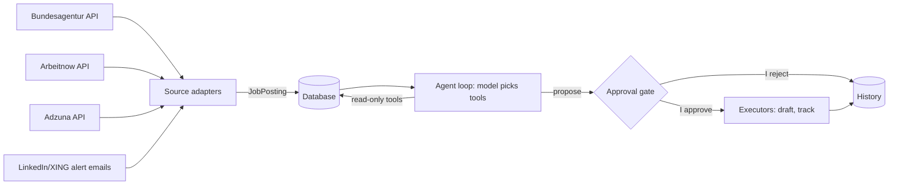

# Job-Search Agent

## Introduction

A job-search assistant for the German/DACH market. It gathers postings from legal sources, matches them to my CV, and proposes next steps. **It never acts on its own:** drafting, saving and sending only happen after I explicitly approve.

## What We Are Building

- ingest postings from official APIs and my own LinkedIn/XING alert emails
- normalize every source into one `JobPosting` schema
- score postings against my CV (embeddings) and my hard filters
- let a model choose tools in a loop to answer questions like "best new AI roles in Berlin this week"
- propose actions (cover-letter draft, tracking entry) behind an approval gate
- store postings, proposals and decisions for traceability

## High-Level Architecture



## The Rule That Shapes the Code

Tools come in two kinds:

| Kind | Examples | What happens |
|---|---|---|
| **Read-only** | search, fetch posting, match to CV | runs immediately |
| **Consequential** | draft cover letter, save application, send email | the model can only create a `ProposedAction`; nothing runs until a human calls `approve` then `execute` |

The model is never handed an executor. This is enforced in code (`app/approval.py`, `app/tools/registry.py`) and covered by tests, not left to the prompt.

## Project Structure

```text
job-agent/
├── app/
│   ├── approval.py          # ApprovalGate: propose -> approve -> execute
│   ├── schemas/
│   │   ├── job.py           # canonical JobPosting
│   │   └── actions.py       # ProposedAction + status
│   └── tools/
│       └── registry.py      # read-only vs propose-only tools
├── tests/test_approval.py   # gate cannot be bypassed
├── AGENTS.md                # rules for coding agents
└── pyproject.toml
```

Later folders (`sources/`, `agents/`, `database/`, `api/`) are added only when working code needs them.

## Weekly Plan

| Week | Build | Covers |
|---|---|---|
| 1 | Manual agent loop, 2 read tools (Bundesagentur, Arbeitnow) | tool use, agent loops |
| 2 | CV matcher + labelled eval set (~20 postings) | embeddings, evaluation |
| 3 | pytest + GitHub Actions CI (eval in CI) | testing, MLOps |
| 4 | Prompt/model A/B test tracked in MLflow | A/B testing |
| 5 | Rewrite loop in LangGraph with approval node | LangGraph, human-in-the-loop |
| 6 | Deploy (Cloud Run or Bedrock), logging, cost tracking | cloud, monitoring |

## Design Principles

- The model reads freely and only proposes; humans approve.
- Canonical schemas everywhere; source payloads stop at the adapter.
- No scraping of LinkedIn or XING. Official APIs and my own alert emails only.
- Never commit credentials, CVs or personal email content.
- One useful capability per week, shipped as a merged PR.
